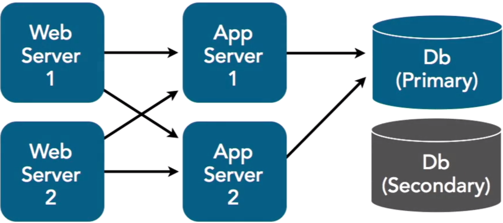
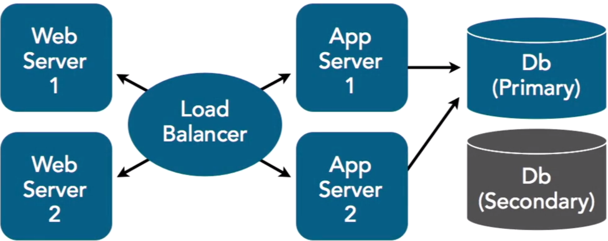
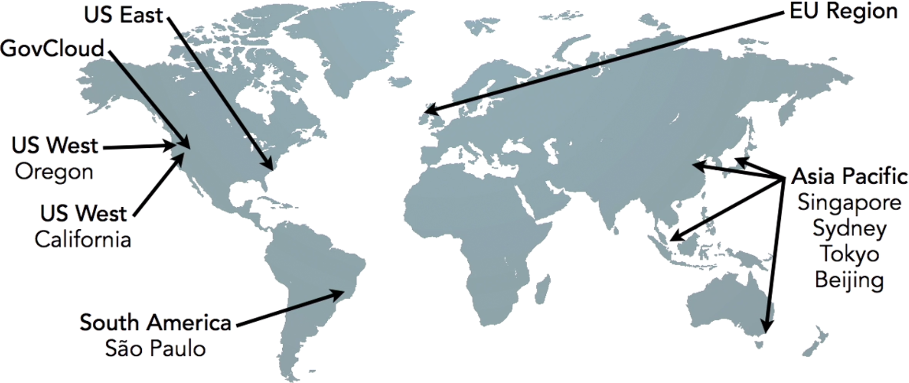
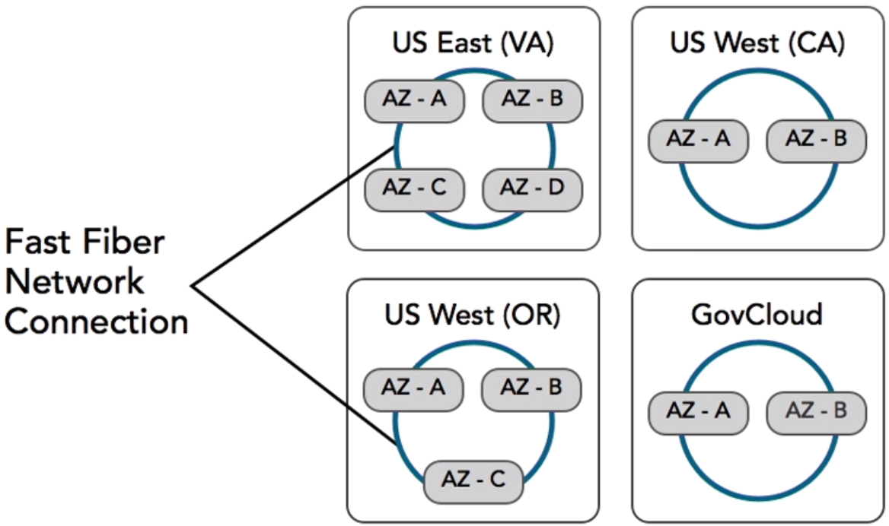
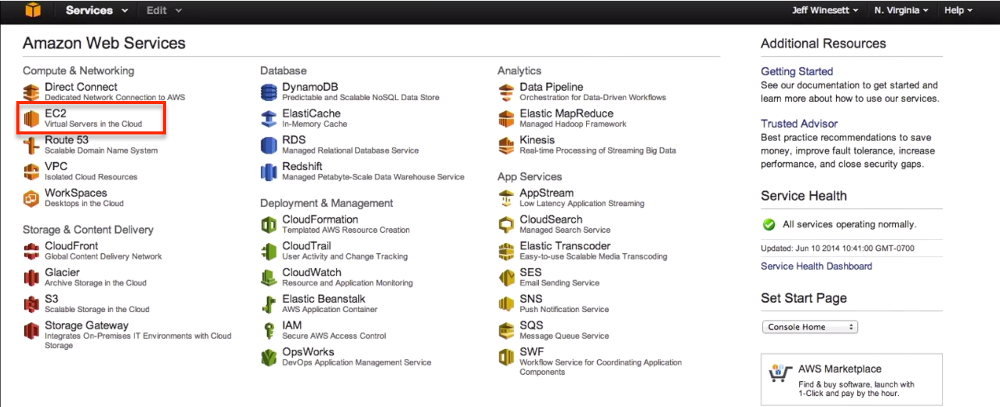
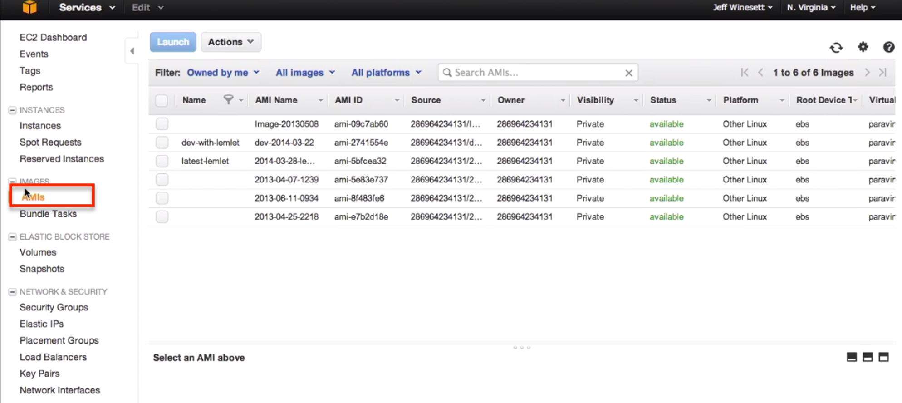
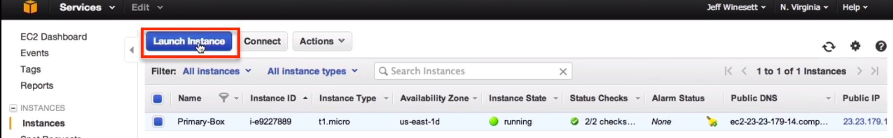
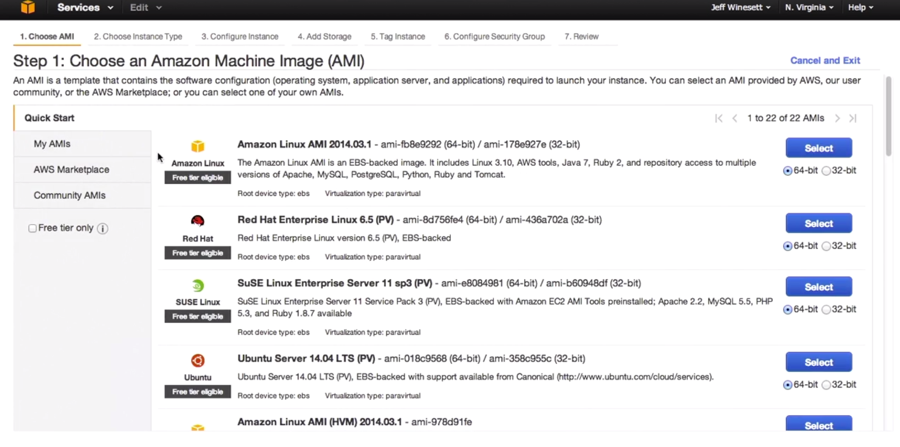
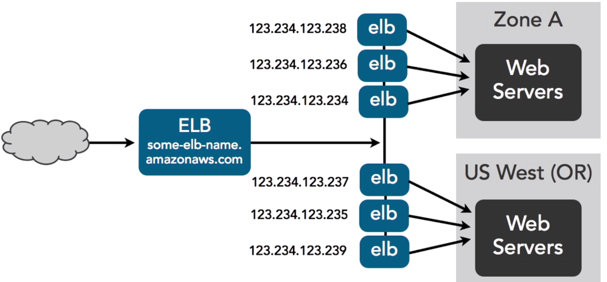

###Amazon Web Services Essential Training - Lynda
===

#####Cloud Services
- Infrastructure as a Service (IaaS)
 - Windows Asure
 - Rackspace Cloud
    
- Platform as a Service (PaaS)
 - Google App Engine
 - PHP Fog
 - Heroku
 
- Software as a Service (SaaS)
 - Google Apps
 - Basecamp
 - Mint

NOTE: AWS offers all three services (IaaS, PaaS, Saas)

#####Business Benefits
- Minimal upfront infrastructure investment
- Just in-time infrastructure - expand based on my needs
- Maximize efficiency of resources
- Only pay for what you use

#####Technical Benefits
- Have APIs for scriptable automations 
- Automatically scale my system Up/Down Right/Left
- Meet anticipated demand
- Ease of implementing disaster recovery infrastructure

#####Scalable Architectures (up/down/in/out)
- Scaling Out (horizontal scaling) - adding capacity to a system by adding more components or nodes that make up that system. For example, adding more web servers to the system to handle an increase in traffic.
- Scaling In (horizontal scaling) - removing capacity from a system, by decreasing the number of components or nodes. For example, scale in the web server tier by reducing the number of running web servers.
- Scaling Up (vertical scalling) - adding resources to a single component or node in our system in order to increase cits capacity to handle load. For example, increasing the number of CPUs or increase the memory of a database server. 
- Scaling Down (vertical scalling) - reducing the resources of a single component or node in the system. 
===

#####Understanding Elasticity: Clouds ability to accomodate changes in load and demand of the system.
- There is not a Cloud server type that has the exact or greater amount of RAM required on single server, that what you already have on premises. In that case, you should think about ways to distribute that need across multiple servers, by rethinking you application architecture, or perhaps by leveraging other available Cloud services, like a distributed memory cache (i.e. AWS EsastiCache).
- You find that the database requires more input/output operations per second, often referred to as IOPS, than what the Cloud provides. There are other ways to achieve this based on your data in use cases. One solution is to distribute across a cluster, thereby scaling out the database layer, or take advantage of other database sharding techniques that can route data and requests to where they need to be. 
- Often, if you find to be hitting constraints with Cloud infrastructure (which in theory is infinitely scalable), this is most likely due to the application architecture not being built in a scalable manner. 

#####Implement Elasticity - ability to scale cloud resource up/down/in/out
- Scale on regular bases: daily/monthly/weekly - highly predictable traffic
- Just when expecting event to happen: due to some events
- Setup monitoring infrastructure (i.e. CPU utilization, or Network IO) - based on this info scale appropriately/automatically

- Automate your deployment process
- Insure that initial system configuration and how you build your applications are streamlined to accomodate scalling
- Bootstrapping instances 
    - refers to creating a self-sustaining start-up process that can run on its own and in the context of AWS
    - tipically involves the process needed to get your application up and running on an EC2 instance
    
#####Loose Coupling
- Minimize dependencies between components
- Example infrastructure: several web servers, app servers and a database server

- Tightly-coupled components:
 
- Loosely-coupled components
 

#####Security
- Provider (AWS) Responsibility
    - Physical security of the building
    - Infrastructure security
    - Equipment security
    - Keeping customers separate

- My Responsibility
    - Network level
    - Application level

- Keep Things Secure
    - Protect the data in motion: 
        - Use SSL for transmitting confidential information
        - SSL certificates could be created per-instance on EC2
        - SSL certificates could be created per-load-balancer - which is a preferable option when supporting multiple applications
	- SSL certification could be created/configured via AWS
    - Protect the data at rest:
        - Encrypt data before storing it on any storage devices
        - Encrypt the entire file storage systems. In AWS file storage comes in 2 different variaties:
    	    - Elastic block storage - persists beyond the lifetime of the underlying instance - **encryptable**
	        - Local storage - will not servive the termination of the instance on which it presides - **encryptable**
	    - Store/Encrypt data in other AWS stores as well
        - Protect AWS access credentials - AWS supplies two types of security credentials:
	        - AWS Access Keys - has two parts to it:
                - A public access key ID
                - A secret key ID: 
                    - when using the APIs, use secret key ID for request authentication
                    - all public API requests sent via the internet should be sent over HTTPS
                    - if your application uses other AWS services, which require your secret key, rather than having your secret key be part of the applicaiton code, you should build your applications in a manner such that this secret key is passed in as arguments during launch of the application. The secret key should also be encrypted before sending.
                    - you can also launch your instance in IAM role - allows an instance to have access to the credentials associated with that role.
                        - IAM role - AWS's service designed so that your applications can securely make API requests from your instances, without requiring you to manage the security credentials that the applications use. Instead of creating and distributing your AWS credentials, you can delegate permission to make API requests using IAM roles. IAM is also used to manage access control: it allows you to create users and manage their permissions by assigning them roles and placing them into groups.
                    - if your secret key has been compromised - request a new one by rotating to a new access key ID
                    - rather than handing out your root account information to everyone that needs access, it is strongly recommended that you create separate users for each person needing access. Then give them access only to the services they need to access.
                    - Make sure to secure your own applications - AWS provides security groups which act as your firewalls to the associated instances - always make sure you lock this down and restrict access to the instances.
                    - Make sure to update all software packages and apply all security patches - all of the pre-cloud application security practices still apply in the cloud.
            - X509 Certificates
===

####Designing for Failure
Avoid single points of failure (2 web servers -> 1 database server) - using Relational Database Service (RDS)

#####Virual Servers (EC2) and Elastic IP
- EC2 - these are the servers used in AWS
- Elastic IPs 
    - are the static IP addresses designed for cloud computing
    - are created for the account and are not specific to a particular instance
    - after creating the elastic IP, you control it and choose when to release it
    - allows you to remap your public IP to any instance on your account
    - Example:
        - let's say you have this web application located at yourdomain.com, and your DNS server has this name associated with a specific IP address. What happens if this server dies? With a traditional static IP, your website will be down until, say you get a friendly data technician to replace the server or reconfigure a new server, or if you happen to have another server standing by, which will have a different IP address, you will need to change your DNS setting to point to this new IP and wait for the DNS to propagate before your site is back available. With Amazon EC2, and when using elastic IP's, you can easily handle this disaster differently. Since the elastic IP is not tied to a specific server but rather to your account, when disaster strikes, you can simply remap the association of the IP from the failed server to a new replacement server. No need to get any data technicians involved, and no need to make any DNS changes. So, design for failure, lesson number one.

##### AWS Regions and Availability Zones 
- The EC2s can be launched in one or more geographical regions. Each regions is a geographically independent collection of AWS resources. These regions are distributed world-wide within four primary land areas. There are four regions in North America:
    - US East - located in Virginia
    - US West - located in California
    - GovCloud - located in the northwest of the US:
        - designed to allow US government agencies, contractors, and their customers to move more sensitive data into the cloud by addressing their specific regulatory and compliance requirements.
    - EU - covering Europe, Middle East, Africa area - located in Ireland
    - South America - located in Sao Paulo
    - Asia Pacific - Singapore, Sydney, Tokyo, and Beigin
         
- These regions are independent of one-another and there is no data replicatins between them
- Customers can launch instances in more than one region: if you have a very strict high-availability and distaster recovery requirements that specify you must have redundant systems that are completely isolated and very far apart geographically, using more than one region will help you meet this requirement.
- Any communications that you establish between regions is across the public internet, so encryption methods should be used to protect your sensitive data.
- Availability Zones: 
    - Even within a region, you can achieve geographical isolation to meet your high availability and disaster recovery needs. This is because each region consists of multiple locations called availability zones.
    - Availability zones are distinct locations that are engineered to be insulated from failures from other availability zones, and provide inexpensive, low-latency network connectivity to other availability zones in the same region. Think of these as distinct data centers connected by fiber network. 
    - North America contains four regions and each of these containes multiple availability zones:
        - US East - 4 availability zones
        - US West (Oregon) - 3 availability zones
        - US West (California) - 2 availability zones
        - GovCloud - 2 availability zones
    - Each of these availability zones are connected by fiber network connection, and are locally geographically isolated from one another so a local disaster (fire, flood, tornado), or other physical breach occuring in one availability zone will not affect the other zones.
 

##### Amazon Machine Image (AMI)
- AMI is a packaged environment containing a software stack, along with all the necessary parts to properly set up and boot an EC2 instance. AMI is a unit of deployment, and you can launch as many instances from the AMI as you need.
- There might be only a single AMI or several AMIs corresponding to different components in the system (web servers, app servers, database servers).
- The AMI typically includes the following:
    - Template for root volume of the instance - an operating system, an applicaiton server and its applications.
    - Launch permissions - control which AWS accounts can use the AMI to launch instances
    - Block device mapping - specifies the volumes to attach to the instance when it's launched.
- Amazon EC2 provides a number of tools to make creating AMIs easy, including the AWS management console.
- After you've created an AMI with specific configurations, you can use that AMI to easily create new instance(s) as many times as needed, across multiple Availability Zones. You can do this programatically using the API, or by using the auto-scalling service, or using the console.
- AWS Console:
 
- A list of AMIs:
 
- A list of Instances:
 
- Create instance from AMI:
 
- Create an instance:
 

##### Elastic Load Balancing (ELB): 
- A component built to balance the traffic across EC2 instances and Availability Zones, and as such it allows your applications to achieve greater fault tolerance. It is elastic in that it automatically scales request-handling capability based on the traffic demands. Elasticity and redundancy is built into this service.
- Characteristics of ELB:
	- It can handle the routing and load balancing of your HTTP, HTTPS, and TCP traffic to your EC2 instance
    - It allows you to set up and configure health checks so it can know whether or not the instances to which it's routing traffic are healthy and should be used. 
    - It can automatically and dynamically grow and shrink with the demand patterns of your application
    - When creating a new ELB you get a single CNAME that you use for DNS configuration. For example, to use to point your web applications domains to.
    - The single CNAME does not change even as the ELB scaling is happening. So how does it do it? 

Fault Tolerance with ELB: 
- ELB helps you achieve fault tolerance by allowing you to distribute trafic across multiple EC2 instances and availability zones.
- Below we see a representation of an ELB routing traffic to two availability zones, but we know these two availability zones are actually geographically separate physical locations within a region. Our single CNAMEd ELB component actually resolves round robin DNS to ELB IP addresses in each availability zone and as traffic increases, AWS adds IP addresses to ELB's DNS entry and continues to round robin requests across the multiplying ELBs. Of course, as traffic decreases it removes the IP addresses from the ELB's DNS entry thereby reducing the number of load balancing components in the system. 
- In summary, use Elastic Load Balancer to easily distribute your system across multiple resources and abailability zones to ensure your system remains up and running even if a single resource fails or disaster strikes.
 

#####Cloudwatch - alert machanisms when a system experiences failure or approaches failure
- Resource and Application monitoring service
- Monitor resources immediately and automatically
- Monitor resource utilization, performance, traffic load demand
- Allows to gather and graph resource metrics such as CPU utilization, disk I/O, and network traffic
- Allows to set alarms when specific metric thresholds are breached, which can then trigger an action such as sending notifications or even kick-off a process to automatically handle the issue such as add or remove another resource.
- By utilizing a simple PUT API request you can define and submit custom metrics generated by your own application and have them monitored by Cloudwatch.

Here is a list of all services that support Cloudwatch monitoring (most are free, with the option to support more detailed monitoring):
- EC2            
- ELB
- EBS
- RDS
- SQS
- SNS
- DynamoDB
- ElastiCache
- EMR
- Redshift
- Route 53
- OpsWorks
- AutoScaling
- Billing

Detailed Monitoring (comes at a >$):
- Provides monitoring at 1 min intervals vs 5 min offered by the free services
- Access to a higher number of predifined metrix
- Ability to monitor aggregate metrics for groups of similar resources

In Summary: 
The design for fauilure lesson #5 - utilize Cloudwatch to get more visibility and take appropriate actions in case of hardware fauilure or permormance issues.

#####Elastic Block Storage (EBS)
The next topic to cover as we explore how to design for faulure is **volume storage** for our EC2 instances.

If you are running an application on EC2, and this application is storing data on the instance, you need to know about your storage options and how to design to ensure you are able to retain this data in the event an instance were to fail. In AWS, volume storage comes in two varieties:
- Elastic Block Storage:
    - persists after an instance is terminated
    - storage resources that are created separetely from EC2 instances and then are attached to EC2s. Once attached they can be used as any other block device. For example, you can create a file system and run a database on top of these storage devices.
    - EBSs come in two flavours:
        - Standard Volumes
        - IOPS Volumes (input/output operations per second)
            - Provisioned IOPS volumes allow you to control and specify consistent performance parameters when creating volumes.
    - Standard and Provisioned IOPS volumes differ in price and performance and choosing one over the other will depend on your specific use cases and budget
    - Multiple volumes can be attached to a single instance, with a max size of 1TB per each volume
    - Point-in-time snapshots
        - can be created and then persisted to Amazon S3
        - these snapshots could also be used to initiate new volumes. 
        - the snapshots can also be copied across AWS regions making it easier to take advantage of AWS regions for systems that require large geographical distribution.
        - the snapshots are easy to take, either through the web console or programmatically through the API
        - a snapshot of the currently running volume can also be taken, however, snapshots only capture data that has been written to the volue at the time the snapshot command is complete. To make a complete snapshot, it is recommended to pause the volume. If you cannot pause all of the writes to the volume, you should consider unmounting the volume from within the instance, then issue the snapshot command and then remount the volume to ensure a consistent and complete snapshot. While the snapshot status is in a pending state you can remount and reuse the volume.
        - snapshots are stored incrementally - you are billed only for the storage that is equal to the difference between current and the previous snapshots
        - all active snapshots contain all the information needed to restore the volume to the instant at which the snapshot was taken
        - snapshots can be used to create new volumes or chage attributes of existing ones: for example, expanding the size of a volume or moving volumes across availability zones, or sharing them across regions.
        -  A few of the key characteristics of snapshots:
            - Immediate access to data (**lazy loading**) - If you create a volume from a snapshot, all of this data stored in S3 will have to be transferred to your newly created volume. However, if you want to start using the volume with one of your instances right away, you can. The restoring of new volumes from EBS snapshots implements a lazy loading approach. So, any data that you start to access will be prioritized in the transfer. And if not already retrieved, will be immediately retrieved upon the first request, so you can begin using them right away.
            - Resizing volumes -  When you create a new Amazon EBS volume based on a snapshot, you may change the size specified for the new volume. You will want to double check that your file system and/or your application supports such a resizing.
            - Sharing - Snapshots are also easy to share. Amazon EBS snapshots make it easy for you to share your data, say with your coworkers or others in the AWS community. Users can create their own Amazon EBS volumes based on the EBS snapshots you decide to share.
            - Copying across regions -  The ability to copy snapshots across regions makes it easier to take advantage of using AWS regions for geographical distribution

    - Cloudwatch can be used to view performacne metrics for the EBS volumes providing the insight into metrics such as throughput and latency.
- Ephemeral Volumes (Local Storage) - does not servive termination

#####Relational Database Services (RDS)
When the database part of your application fails, you want to ensure a safe and quick recovery. If you are using a relational database to store persistent information in your application, you definitely want to consider using Amazon Relational Database Service. Amazon Relational Database Service, or simply RDS, provides an easy way to **setup**, **operate**, and **scale** a relational database in the cloud.

You can launch a DB instance and get access to a full featured relational database without having to worry much about common database administration tasks like **backups**, **patch management**, and **security management**. RDS is also configured in such a way so that you can easily achieve **high avialability** and **high redundancy** requirements as well.

Using RDS:
- Create a database instance using the web console or the API
- Specify the engine type: MySQL, Postgres, SQL Serer, Oracle
- Specify DB instance size, and a few other configuration options
- Once created, the instance is available to connect with your application
- You can watch to monitor the general health of your DB instances using Cloud Watch
- While you do have remote access to your database through the command line client, or other GUI tools you may use for your database management, unlike EC2 instances, you don't have SSH access to these instances, and do not have root access. This is actually one of the benefits when using RDS.
-  You are turning over a lot of the administrative tasks to Amazon:
    - Amazon RDS will automatically apply security patches on your behalf and will back up your database, storing the backups for a user defined retention period, and enabling point-in-time recovery from these backups.
    - If you take advantage of the ability to deploy in multiple availability zones, and/or creating read-replicas of the database for increased performance and scalability, you are handing even more of the complex administration and configuration tasks over to AWS, thus, allowing you to stay focused less on boilerplate administration and configuration, and more on building what matters for you and your business. 

Design for failures #7:
- Design for Failure Lesson Number Seven: Consider using RDS to simplify database security, administration, backups, redundancy, failovers, scalability, and geographical distribution.
===

#####Bootstrapping
Learn about the services and tools needed to help take advantage of the elastic nature of the Cloud, and as has been mentioned before, taking advantage of the Cloud's elastic nature is going to drive some of the biggest benefits you will realize from a Cloud-based environment versus a traditional one.

