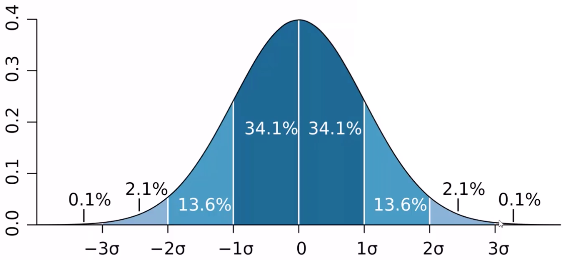
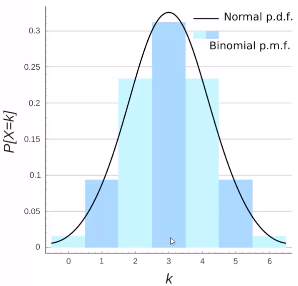

## Data Science and Machine Learning with Python - Hands ON!

Installation: stick with Python 3

```bash
ipython3 notebook          # install the necessary packages in virtualenv 
pip install xlrd           # reading Excel spreadsheets with python
pip install scikit-learn   # the scikit library
pip install statsmodels    # dependencies include patsy, scipy
pip install pydot2         # visualizing decision trees with python
```

**Statsmodels**: 
- Allows users to explore data, estimate statistical models, perform statistical tests
- Provides descriptive statistics, statistical tests, plotting functions, and result statistics for various types of data and estimator
- Fully meets the needs for statistical computing and data analysis in python. Features include:
	- Linear regression models
	- Generalized linear models
	- Discrete choice models
	- Robust linear models
	- Many models and functions for time series analysis
	- Nonparametric estimators
	- A collection of datasets for examples
	- A wide range of statistical tests
	- Input-output tools for producing tables in a number of formats (Text, LaTex, HTML)
	- Used for reading Stata files into NumPy and Pandas.
	- Plotting functions
	- Extensive unit tests to ensure correctness of results
	- Many more models and extensions in development

**Enthought Canopy**: Testing workflow with Canopy IDE -> Not for me...

Check out the first file: Outliers.ipynb

### Chapter 2: Statistics and Probability Refresher - with Python

#### Types of Data
**Numerical, Categorical, Ordinal**

**Numerical**:
- Represents some sort of quantitative measurement:
    - Heights of people, page load time, stock prices, etc.
- Discrete Data:
    - Integer based - often counts of some event
        - How many purchases did a customer make in a year
        - How many times did I flip "heads"
- Continuous Data:
    - Has an infinite number of possible values
        - How much time did it take for a user to checkout out?
		- How much rain fell on a given day?

**Categorical**:
- Qualitative data that has no inherent mathematical meaning:
    - Gender, Yes/No (binary data), Race, State of Residence, Product Category, Political Party
    - You can assign numbers to categories in order to represent them more compactly, but the numbers don't have mathematical meaning

**Ordinal**:
- A mixture of numerical and categorical
- Categorical data that has mathematical meaning:
    - Ratings must be 1, 2, 3, 4, 5
    - But these values have mathematical meaning: 1 means is worse than 2 stars

#### Mean, Median, and Mode

- Mean == average
- Median == sort -> take the middle value - less susceptible to outliers than the mean
- Mode == [category/number : frequency of accurance] => first_house: 4 kids, second_house: 2 kids -> mode is first_house => category or discrete number with the highest frequence of occurance

#### Using Mean, Median, and Mode in Python

```python

import numpy as np

incomes = np.random.normal(27000, 15000, 10000) # (center_value, std_dev, population)
np.mean(incomes) # calculate mean

import matplotlib.pyplot plt
plt.hist(incomes, 50) # (data, buckets)
plt.show() # display histogram

np.median(incomes) # cal median

# let's skew data
incomes = np.append(incomes, [1000000000])
np.median(incomes) # median is about the same
np.mean(incomes)   # skewed to the right!

# let's calculate the mode
ages = np.random.randint(18, high=90, size=500)
ages # array([500 values])

from scipy import stats # statistics
stats.mode(ages) # (array([34]), array([13])) => (mode, frequency_of_mode) => age 34 appeared 13 times
```

#### Variation and Standard Deviation

**Variance** - how spread is the dataset 
- Variance (sigma^2) - the average of the squared differences from the mean
```
dataset = (1, 4, 5, 4, 8)
1. Find the mean: 4.4
2. Find the differences from the mean: (-3.4, -0.4, 0.6, -0.4, 3.6)
3. Find the squared differences: (11.56, 0.16, 0.36, 0.16, 12.96) # emplify differences
4. Find the average of the squared differences:
   Variance = (11.56 + 0.16 + 0.36 + 0.16 + 12.96) / 5 = 5.04
5. Find standard deviation
   std_dev(sigma) = \sqrt{variance == sigma^2} # used to identify outliers
6. In normal destribution:
   - 1 std_dev from the mean considers to be normal for normal destribution
```
- Population (sigma^2) vs. Sample Variance (S)
```
sigma^2 = (11.56 + 0.16 + 0.36 + 0.16 + 12.96) / 5 = 5.04
S = (11.56 + 0.16 + 0.36 + 0.16 + 12.96) / 4 = 6.3
```
- Population variance: sigma^2 = \frac{\sum(X - mean)^{2}}{N}
- Sample variance: S = \frac{\sum(X - mean)^{2}}{N - 1}

```python
import numpy as np
import matplotlib.pyplot as plt
incomes = np.random.normal(100.0, 50.0, 10000)
plt.hist(incomes, 50)
plt.show()

incomes.std() # 49.79...
incomes.var() # 2479.46...
```

#### Probability Density Function and Probability Mass Function

Probability Density/Destribution Function:
- Normal Destribution: probability of a given range of values occuring
    - Probability of a value falling within 1 std_dev is hight, for example


Probability Mass Function: when dealing with discrete data - visualizing probability of discrete data
- We could plot a probability density function (normal destribution) on the discrete data points
- However, if we want to quantize the discrete dataset, we could use histogram: the number 3 accures a set number of times (vs. a percent occurance of a range of values with normal destribution).


#### Common Data Distributions
Distributions.ipnb

**Uniform Distribution**: a constant probability of a value occuring within a given range

```python
import numpy as np
import matplotlib.pyplot as plt

values = np.random.uniform(-10, 10, 100000) # (min, max, values)
plt.hist(values, 50)
plt.show()
# an equal change of any given value (range of values) occuring within the data
# x => (range of values), y => (frequency of occurance of each value or range of values)
```

**Normal / Gaussian** - Probability Density Function

- Visualize Probability Density Function 
```python
from scipy.stats import norm
import matplotlib.pyplot as plt

# create a list of x numbers (from, to, step)
x = np.arange(-3, 3, 0.001)
plt.plot(x, norm.pdf(x)) # (x, y)
```

- Generate some random numbers with a normal distribution
```python
import numpy as np
import matplotlib.pyplot as plt

mu = 5.0
sigma = 2.0
values = np.random.normal(mu, sigma, 10000)
plt.hist(values, 50)
plt.show()
# Normal distributions histogram with mean = 5, std_dev = 2.0
```

**Exponential Probability Destribution Function / "Power Law"**

```python
from scipy.stats import expon
import matplotlib.pyplot as plt

x = np.arange(0, 10, 0.001)
plt.plot(x, expon.pdf(x))  # (x, y)
# exponential distribution line: y decreases exponentially with increasing x
```

**Binomial Probability Mass Function** - dealing with discrete data

```python
from scipy.stats import binom
import matplotlib.pyplot as plt

n, p = 10, 0.5
x = np.arange(0, 10, 0.001)
plt.plot(x, binom.pmf(x, n, p)) # (values, num_of_events[roll a dice 20 times], prob_of_event_occuring)
```

**Poisson Probability Mass Function**: 
If given an average of events occuring at a particular time period, what is the probability of getting a different average values: 
- My website gets on average 500 visits per day. What is the probability of getting 550?


