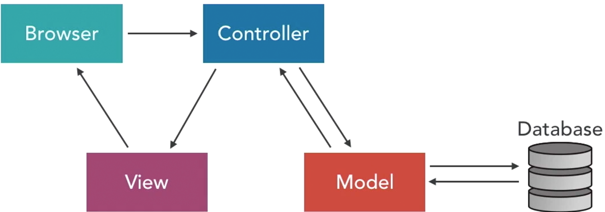

# Ruby on Rails


### Installing Ruby on Rails on Mac

- PATH setup - **Important to add the eval statement**
```bash
# ~/.bash_profile
export PATH="/usr/local/bin:/usr/local/sbin:/usr/local/mysql/bin:$PATH"
eval "$(rbenv init -)" # run this comman every time a window is opened
```

- Install Xcode Developers Tools: gcc
```bash
$ gcc -v
$ xcode-select --install 
```

- Install Homebrew
```bash
# get the curl code from Homebrew homepage
$ brew doctor
$ brew update # update packages
```

- Install Ruby: 2.4.0: use RVM or RBENV for managing ruby versions - virtual envs
```bash
$ ruby -v
# Get the Released version
$ brew update
$ brew install rbenv # manages switching between ruby versions
$ brew install ruby-build  # installs ruby - it is installed as a dependency
$ rbenv install --list # list all available ruby version - choose the most recent that is not a preview release
$ rbenv install 2.3.1 # grab and install the package
$ rbenv rehash # every time a new ruby version or gem is installed - makes rbenv aware of all the new/updated commands
$ rbenv versions # check which versions are installed - "*" indicates which version is activated
$ rbenv global 2.3.1 (2.4.0) # will setup ruby version for the user
$ rbenv versions # will activate 2.3.1 version
$ rbenv local 2.3.1 # will setup ruby version for a particular dir
$ rbenv shell 2.3.1 # will change version for the current window
$ rbenv uninstall # blahblah
```

- Install RubyGems: another package manager - ruby helper libraries and packages (rails is a gem)
```bash
$ gem -v
$ gem list # to list all installed gems
$ gem update --system # update gem version
$ gem -v # the newest version should have been installed
```

Visit **rubygems.org** to check all of the available gems and dependencies

- Install Rails gem
```bash
# Make sure to activate proper ruby version
$ rbenv global/local/shell 2.4.0
$ gem install bundler # necessary for managing rails applications
# be careful to NOT use sudo as recommended by some stackoverflow posts
#+ it creates downstream issues when trying to connect to db
#+ if excidentally installed with sudo, make sure to remove gem/doc||test/nokogiri
#+ as all nokogiri gems will be installed with sudo/root
$ gem install nokogiri # a dependency of other tools
# download rails gem + dependencies
$ gem install rails
$ gem list # view all of the installed gems
$ rails -v # rails version -> 5.0.2
```

- Install MySQL | set default pw | Install MySQL RubyGem
```bash
$ brew update
$ brew install mysql
# to run mysql as is
$ mysql.server start
$ mysql -uroot
# to run mysql as a launch deamon
brew services start mysql
# to configure root pw/security
$ mysql_secure_installation # to set a root password
$ mysql -uroot -p # enter the pw
# local credentials
root:whitehat
rails_user:rails_user_pw

# now isntall rubygem for mysql or postgres
gem install mysql2
gem install pg
```

- Installing Web Server

Production: Apache2 or NGINX

Passenger or Unicorn: are the lighter web servers that help handling requests between rails and the production server.

For development: WEBrick (prev versions) -> Puma (Rails 5) - allows concurrency, can be used in production, **comes with rails**

- Create a new project
```bash
cd ~/Sites
rails new demo_project -d mysql
rails new demo_project_pg -d postgresql # create files + bundle (installs all ruby gems for the app)
# every time a gem is added, run:
bundle install # to update the gems
```

Now, attatch this project to the currently activate ruby version
```bash
cd demo_project
ruby -v
rbenv local 2.3.1 # a new file will appear in the root dir:
# .ruby-version - indicates which ruby version is used by this project

```

- Connect the database with the new project
```bash
# create dev and test database
mysql -u root -p
mysql> create database demo_project_mysql_dev;
mysql> create database demo_project_mysql_test;
# create a user in addition to the root user for db connections
# grant to the new user db privileges for all tables
mysql> grant all privileges on demo_project_mysql_dev.* to 'rails_user'@'localhost' identified by 'rails_user_pw';
mysql> grant all privileges on demo_project_mysql_test.* to 'rails_user'@'localhost' identified by 'rails_user_pw';
mysql> exit
```

- Edit config that connects rails to database
```bash
default: &default
  adapter: mysql2
  encoding: utf8
  pool: 5
  username: rails_user
  password: rails_user_pw
  socket: /tmp/mysql.sock

development:
  <<: *default
  database: demo_project_mysql_dev

### ....
```

- Ran into an interesting **ERROR** at this point on my Mac when running **rails db:schema:dump**
```text
...blahblah
LoadError: dlopen(/Users/whitehat/.rbenv/versions/2.4.0/lib/ruby/gems/2.4.0/gems/nokogiri-1.7.0.1/lib/nokogiri/nokogiri.bundle, 9): Library not loaded: /usr/local/opt/zlib/lib/libz.so.1.2.8
  Referenced from: /Users/whitehat/.rbenv/versions/2.4.0/lib/ruby/gems/2.4.0/gems/nokogiri-1.7.0.1/lib/nokogiri/nokogiri.bundle
  Reason: image not found - /Users/whitehat/.rbenv/versions/2.4.0/lib/ruby/gems/2.4.0/gems/nokog
...more of blahblah
```

After some analysis it looks as if the **zlib** installation is off. Here is how I fixed it:
```bash
# manually deleted old links
rm -rf /usr/local/opt/zlib # link to /usr/local/Cellar/zlib/1.2.11
rm -rf /usr/local/Cellar/zlib # /lib/1.2.8 was actually installed with only r permissions
gem uninstall nokogiri # to double check that nokogiri didn't try to install zlib dependency
gem install nokogiri # zlib wasn't installed
bundle install # to make sure all of the gems are bundled - not necessary step

brew untap homebrew/dupes
brew tap homebrew/dupes
brew install zlib
brew list zlib # the links in /usr/local/opt/zlib -> /usr/local/Cellar/zlib/1.2.11 properly

rails db:schema:dump # properly generate project/db/schema.rb output
``` 

- Launch a Project!
```bash
# go to the projec root
$ rails server # go to localhost:3000
```

### Starting Project in RONR 5 Essentioal Training

```bash
rails new simple_cms -d mysql
# after updating the gems, install bundler will need to be run agian
```

- File Structure

```bash
simple_cms
├── app
│   ├── assets          # js/css/img
│   ├── channels        # action cable - websockets
│   ├── controllers
│   ├── helpers         # view helpers
│   ├── jobs            # repeating tasks
│   ├── mailers         # sending email
│   ├── models
│   └── views
├── bin
│   └── ...
├── config               # db configs, routers
│   └── ...
├── db                  # db data, migration files                   
│   └── seeds.rb
├── lib                 # custom code used from project to project
│   ├── assets
│   └── tasks
├── log                 # log files, errors
├── public              # public files that are not served by app
│   └── ...
├── test                # test unit, rspec
│   └── ...
└── vendor              # 3rd party ruby code that is not in gems
    └── assets
--Gemfile               # specifies which ruby gems are used
```

- Basic Configs

1. Define Gemfile - include any necessary gems used in the project

	```bash
	# then run
	bundle install # part of the bundler gem
	```

2. Configuraiton that apply to the app throughought - **application.rb**

	```ruby
	require_relative 'boot'

	require 'rails/all'

	# Require the gems listed in Gemfile, including any gems
	# you've limited to :test, :development, or :production.
	Bundler.require(*Rails.groups)

	module SimpleCms
	  class Application < Rails::Application
		# Settings in config/environments/* take precedence over those specified here.
		# Application configuration should go into files in config/initializers
		# -- all .rb files in that directory are automatically loaded.
	  end
	end
	```
	- **config/environments/... ** - will preceed this file
	- **config/initializers ** - will be called after this file 


